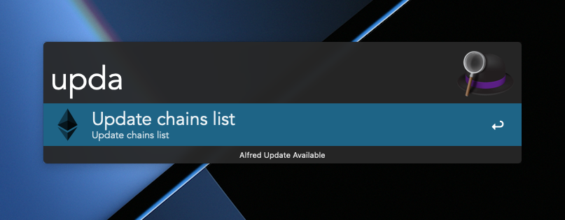

# Blockchain explorer search

Retrieve information about the chain from chainlist and quickly display the blockchain explorer in your browser.

The data is kept in a cache.

The `update bes` command updates the chailist.




## Installation

- [Download and extract the latest release](https://github.com/monk-developper/alfred-blockchain-scan-workflow/releases/tag/v0.1)
- Open the .alfredworkflow file in Finder

## Usage

### example

```bash

# binance chain
bes BSC

# eth chain
bes ETH

```

### command

| **_arg[0]_** | **_arg[1]_**  | **_Description_**                     |
| ------------ | ------------- | ------------------------------------- |
| bsc          | \<chain name> | Open the browser                      |
| update bsc   | -             | Fetch json and png from the chainlist |

- If you want to get information about a new chain, `update bes`

## Usage package

[chainlist](https://chainlist.org/ "chainlist")

[chainlistGithu](https://github.com/DefiLlama/chainlist "chainlistGithu")

[awgo](https://pkg.go.dev/github.com/deanishe/awgo "awgo")

## Contributing

See [this README](CONTRIBUTING.md)

## Thank you

I am a crypto idiot.

Please DM me on Twitter to invite me to work with you!

[](https://twitter.com/MonkDeveloper)
